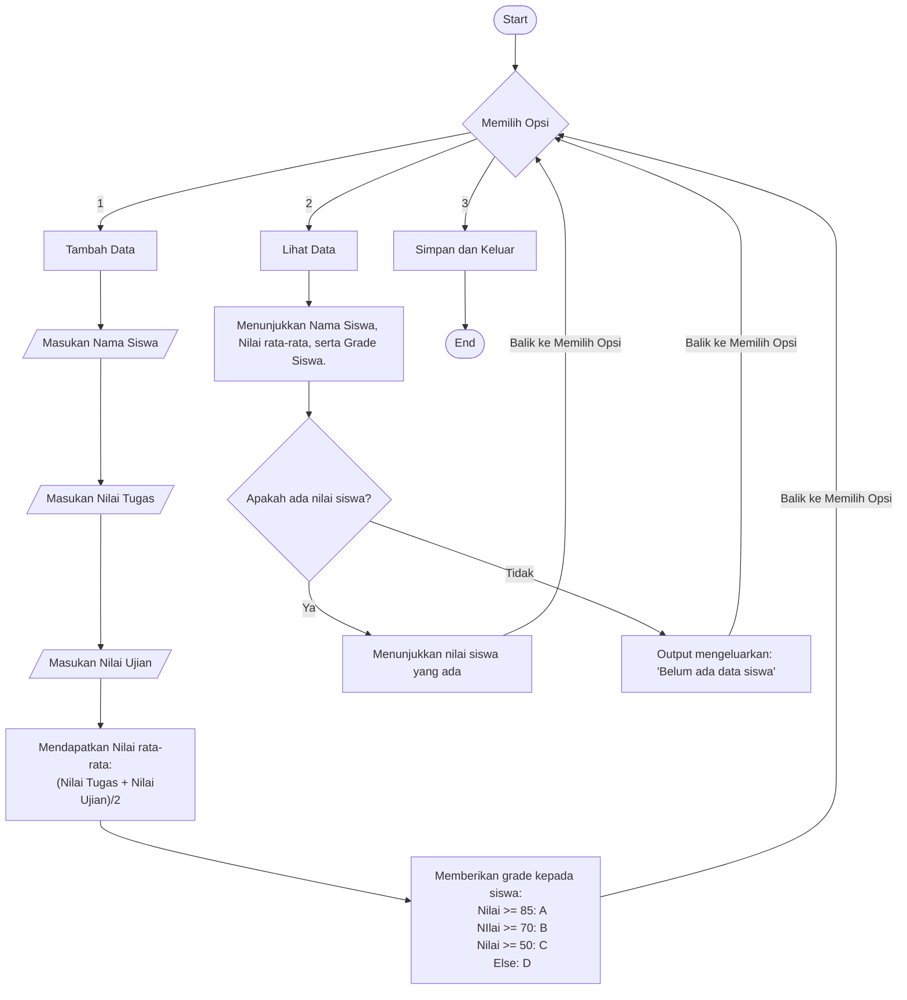

Judul Program: Aplikasi Pengelolaan Nilai Siswa

Pendahuluan: Aplikasi Pengelolaan Nilai Siswa ini adalah program Python yang dibuat untuk mencatat dan pengolahan nilai siswa. Pengguna bisa memasukkan nama, nilai tugas, dan nilai ujian. Program akan otomatis menghitung rata-rata dan menentukan grade berdasarkan standar penilaian, dan dapat menampilkan nama, nilai rata-rata serta grade siswa tersebut.

Fitur Utama:
- Input data siswa (nama, nilai tugas, nilai ujian)
- Menghitung rata-rata nilai
- Penentuan grade secara otomatis (A–D)
- Menampilkan seluruh data siswa
- Menyimpan dan keluar dari program

Panduan Instalasi :
- Pastikan Git sudah terinstall 
- Buka Visual Studio Code
- Buka Folder tempat yang di inginkan untuk menyimpan repositori 
- Buka Terminal pada VsCode 
- kemudian ketik "git clone https://github.com/ren27r/kelompok-3-pemrograman" di terminal.

Panduan Menjalankan:
- Buka folder yang sudah di install sebelumnya Bernama kelompok-3-pemrograman di Visual Studio Code
- Ketik "python main.py" pada terminal, dan akan muncul menu ini:
=== MENU UTAMA ===
1. Tambah Data Siswa
2. Lihat Data Siswa
3. Simpan & Keluar
Pilih menu (1/2/3):
	
ketik pada terminal dari angka 1-3 untuk memilih menu yang kalian inginkan misalnya ketik '1' pada terminal lalu enter untuk membuka menu tambah data

1. Menu "1" akan meminta anda untuk menginput data Nama siswa, Nilai Tugas, dan Nilai Ujian.
2. Menu "2" akan melihatkan Nama Siswa, Nilai Rata-Rata, dan Grade (A,B,C, dan D), jika belum ada data yang dimasukkan sebelumnya, program akan memberikan output "Belum ada data siswa."
3. Menu "3" akan mengeluarkan anda dari program.

Dokumentasi Teknis (flowchart):

Daftar Kontributor:
| Nama                           | NIM          | Link Akun                                |
| ------------------------------ | ------------ | ---------------------------------------- |
| Rendy                          | 250211060046 | https://github.com/ren27r                |
| Gilbert Christian Kennedy Ulag | 250211060060 | https://github.com/Gilbert2669           |
| Victoria Princella Grace Musu  | 250211060050 | https://github.com/victoriamusu026-maker |